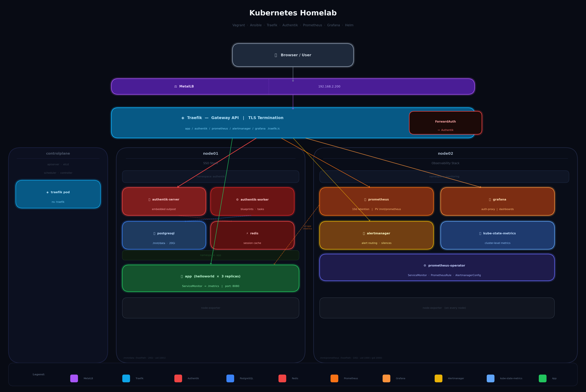

# Kubernetes Homelab

A fully automated 3-node Kubernetes homelab provisioned with **Vagrant** and **Ansible**. One `vagrant up` brings up the entire cluster with SSO, observability, TLS termination, and a sample application — no manual steps required.



---

## Stack

| Layer | Tool |
|---|---|
| VM provisioning | Vagrant + VirtualBox |
| Configuration management | Ansible |
| Container runtime | containerd |
| Kubernetes | kubeadm (v1.x) |
| Ingress / Gateway | Traefik (Gateway API) |
| Load balancer | MetalLB |
| SSO | Authentik |
| Observability | kube-prometheus-stack (Prometheus, Alertmanager, Grafana) |
| Sample app | hashicorp/http-echo |

---

## Cluster layout

| Node | IP | Role | Workloads |
|---|---|---|---|
| controlplane | 192.168.2.16 | Control plane | Traefik, CoreDNS |
| node01 | 192.168.2.17 | Worker | Authentik (server, worker, PostgreSQL, Redis) |
| node02 | 192.168.2.18 | Worker | Prometheus, Alertmanager, Grafana, kube-state-metrics |

MetalLB exposes a single LoadBalancer IP: **192.168.2.200**

---

## Prerequisites

- [Vagrant](https://developer.hashicorp.com/vagrant/install) >= 2.3
- [VirtualBox](https://www.virtualbox.org/wiki/Downloads) >= 7.0
- [Ansible](https://docs.ansible.com/ansible/latest/installation_guide/) >= 2.14

---

## Quick start

```bash
git clone <repo-url>
cd vagrant
vagrant up
```

The provisioner will:
1. Boot three Ubuntu 24.04 VMs
2. Install containerd and Kubernetes on each node
3. Initialize the control plane and join the workers
4. Deploy MetalLB, Traefik, Authentik, the sample app, and the full observability stack

Total provisioning time: ~15–20 minutes.

### /etc/hosts

Add the following entries on your host machine so the `.traefik.lc` domains resolve to MetalLB:

```
192.168.2.200 authentik.traefik.lc
192.168.2.200 app.traefik.lc
192.168.2.200 dashboard.traefik.lc
192.168.2.200 prometheus.traefik.lc
192.168.2.200 alertmanager.traefik.lc
192.168.2.200 grafana.traefik.lc
```

---

## Access

All services are exposed over HTTPS with a self-signed certificate (accept the browser warning).

| Service | URL | Credentials |
|---|---|---|
| Traefik dashboard | https://dashboard.traefik.lc | `admin` / `password` |
| Authentik | https://authentik.traefik.lc | `akadmin` / set on first login |
| Sample app | https://app.traefik.lc | via Authentik SSO |
| Prometheus | https://prometheus.traefik.lc | via Authentik SSO |
| Alertmanager | https://alertmanager.traefik.lc | via Authentik SSO |
| Grafana | https://grafana.traefik.lc | via Authentik SSO |

> Authentik requires a one-time password setup on first login at https://authentik.traefik.lc/if/flow/initial-setup/

---

## Features

### TLS termination
Traefik terminates TLS using a self-signed certificate stored as a Kubernetes Secret. All HTTP traffic is permanently redirected to HTTPS.

### Gateway API routing
All routes are defined as `HTTPRoute` resources (Kubernetes Gateway API) — no `Ingress` objects. Traefik acts as the Gateway controller.

### SSO with Authentik
Authentik is configured automatically via a **Blueprint** (ConfigMap mounted at `/blueprints/custom/`). The blueprint provisions:
- Proxy providers for `app`, `prometheus`, `alertmanager`, and `grafana`
- Applications linked to each provider
- The embedded outpost with all four providers attached

No manual UI configuration is needed. The embedded outpost handles ForwardAuth for all protected routes.

### Observability
- **Prometheus** scrapes cluster metrics with 10-day retention, stored on a hostPath PV on node02
- **Grafana** ships with three pre-loaded community dashboards: Traefik, Node Exporter Full, Kubernetes Views Pods
- **kube-state-metrics** exposes Kubernetes object metrics
- **ServiceMonitor** scrapes the sample app's `/metrics` endpoint every 30s
- Grafana authentication is handled via Authentik proxy header (`X-authentik-username`) — no separate Grafana login

### Persistent storage
| Workload | PV path | Node | Owner |
|---|---|---|---|
| Authentik PostgreSQL | `/mnt/data` | node01 | `1001:1001` |
| Prometheus | `/mnt/prometheus` | node02 | `1000:2000` |

Both directories are pre-created by Ansible with the correct ownership before Helm installs run.

---

## Project structure

```
vagrant/
├── Vagrantfile
├── ansible/kubernetes/
│   ├── kubernetes-playbook.yml
│   ├── group_vars/all.yml
│   └── roles/
│       ├── control-plane/      # kubeadm init, CoreDNS patch
│       ├── workers/            # kubeadm join, hostPath dirs
│       ├── utilities/          # Helm charts, manifests, app
│       └── clean/              # tear-down tasks
└── app/                        # Sample app manifests (source of truth)
```

---

## Tear down

```bash
vagrant destroy -f
```

---

## Known limitations

- Self-signed TLS certificate — browsers will show a security warning
- No external DNS; `/etc/hosts` entries must be added manually on the host
- hostPath volumes are tied to specific nodes — data is lost on `vagrant destroy`
- Authentik initial password must be set manually via the setup flow URL
